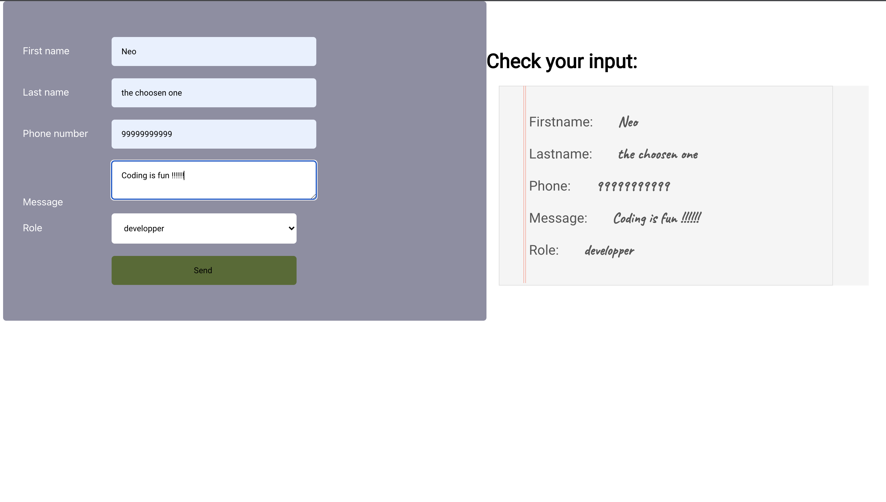

# Form manipulation app:

## description:

- An application developped with React.js for the webdev program held by Business College Helsinki.
- the application allows form manipulation. The user fillout the form fields, the data entered is then displayed in another component rendered seperately.

## Used concepts:

- Passing Props from parent elements to children
- Defining methods in the class components and allow the app to render the states as the change.
- Passing methodes from one component to another.
- Manipulating the rendering using CSS.
- Using a local storage to post the data from the form.

## App screenshots

